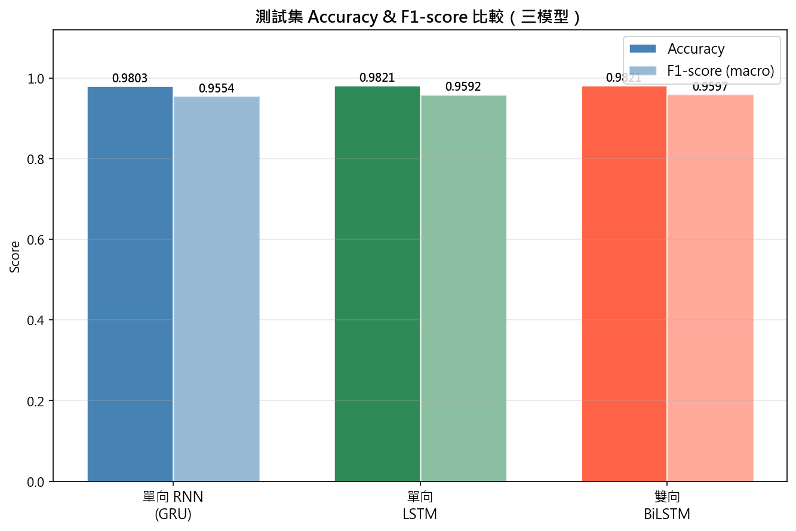
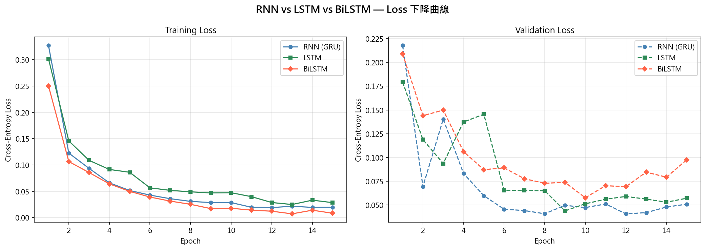

# PyTorch Sequence Model Comparison

這是自然語言處理課程的控制變因實驗，以相同資料切分、random seed 與超參數，比較 GRU、LSTM 與 BiLSTM 在 SMS 垃圾簡訊分類上的效果、參數量與過擬合現象。

## 實驗結果

| 模型 | 參數量 | Test Accuracy | Test Macro F1 |
| --- | ---: | ---: | ---: |
| GRU | 415,746 | 0.9803 | 0.9554 |
| LSTM | 473,602 | **0.9821** | 0.9592 |
| BiLSTM | 836,354 | **0.9821** | **0.9597** |

BiLSTM 的 F1 最高，但參數量約為 GRU 的兩倍，validation loss 在後期也出現上升；在這個短文本任務上，GRU 以較少參數取得接近的表現。





## 實驗設計

- 資料：SMS Spam Collection，共 5,574 筆 ham／spam 簡訊。
- 固定 random seed 為 42。
- 三個模型共用 embedding size、hidden size、層數、dropout、learning rate、epochs 與資料切分。
- 同時比較參數量、Accuracy、Macro F1 與 loss 曲線，而不只報告單一分數。

完整流程位於 [sequence_model_comparison.ipynb](notebooks/sequence_model_comparison.ipynb)，Notebook 會自動從 UCI 下載資料，因此倉庫不重複保存資料集。

## 執行

```bash
python -m venv .venv
# Windows: .venv\Scripts\activate
pip install -r requirements.txt
jupyter lab notebooks/sequence_model_comparison.ipynb
```

資料出處、授權與限制見 [DATA_SOURCES.md](docs/DATA_SOURCES.md)。分數來自一次課程實驗，不代表真實電信環境中的部署表現。
